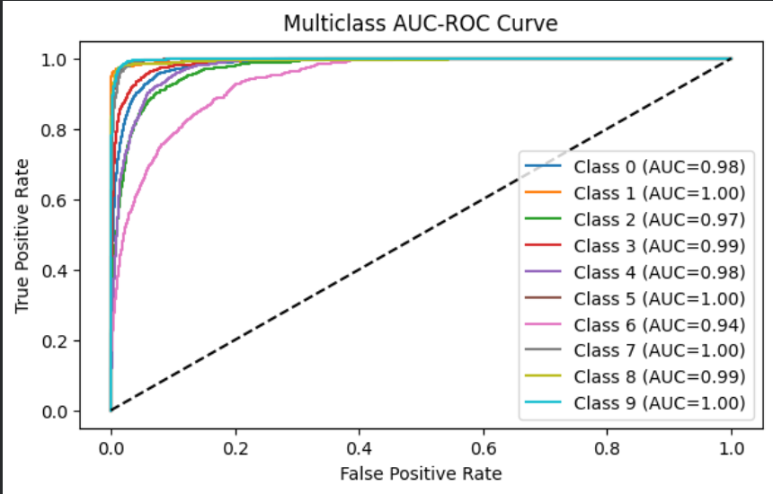
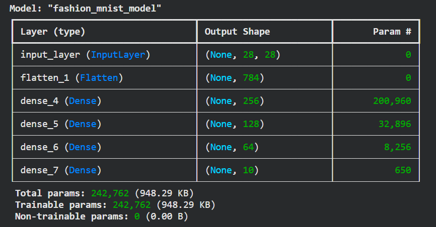

# Deep Learning Essentials with TensorFlow  
### Tensors • Broadcasting • Gradients • Fashion-MNIST Classification

This project is a complete hands-on walkthrough of essential deep learning concepts using **TensorFlow 2.x** and the **Keras Functional API**.  
It includes everything from low-level tensor operations to training and evaluating a full neural network classifier.
---

## 📌 Project Overview

This project demonstrates:

- **Tensor Fundamentals**
  - Scalars, vectors, matrices  
  - Broadcasting  
  - Elementwise operations (multiplication & division)

- **Gradient Computation**
  - Using `tf.GradientTape` for automatic differentiation

- **Neural Network Model**
  - Built with the **Keras Functional API**
  - Custom architecture with multiple activation functions
  - Experiments with different optimizers

- **Training & Evaluation**
  - Fashion-MNIST dataset  
  - Accuracy and validation accuracy curves  
  - Precision, Recall, F1-Score  
  - Multiclass AUC-ROC Curves  

---

## 📁 Repository Contents

| File | Description |
|------|-------------|
| **tensorflow_fashion_mnist_project.ipynb** | Main Colab notebook containing the full project (tensors → model → evaluation) |
| **Model.png** | Visualization of the model’s architecture/summary |
| **Training vs Validation.png** | Accuracy plot comparing training vs validation |
| **Multiclass AUC-ROC curve.png** | ROC curves for all Fashion-MNIST classes |
| **README.md** | Project documentation (you are reading it) |

---

## 🧠 Key Concepts Covered

### 🔹 TensorFlow Basics
- Scalar, vector, matrix creation  
- Shape understanding  
- Broadcasting rules  
- Matrix multiplication vs elementwise operations  

### 🔹 Gradient Computation
Using:
```python
tf.GradientTape()
````

to compute derivatives of tensor operations — essential for training neural networks.

### 🔹 Model Architecture (Functional API)

The model includes:

* Flatten layer
* Multiple Dense layers
* ReLU, Tanh, SELU activations
* Softmax output (10-class classification)

### 🔹 Evaluation Metrics

Includes:

* Accuracy
* Precision (macro average)
* Recall (macro average)
* F1-Score
* Multiclass ROC + AUC

---

## 📊 Visual Results

### 📈 Training vs Validation Accuracy


### 🔍 Multiclass AUC-ROC



### 🧱 Model Architecture



---

## 🚀 How to Run This Project

### **Option 1: Google Colab (Recommended)**

1. Upload the `.ipynb` notebook
2. Run all cells
3. Make sure GPU runtime is enabled (optional for speed)

### **Option 2: Local Machine**

```bash
pip install tensorflow numpy matplotlib scikit-learn
jupyter notebook
```

Open the notebook and run all sections.

---

## 📊 Dataset

This project uses the **Fashion-MNIST** dataset from `keras.datasets`, containing:

* 70,000 grayscale images
* 28×28 pixels
* 10 clothing categories

---

## 🎯 Purpose of This Project

This project is designed to:

* Build deep learning fundamentals
* Demonstrate TensorFlow workflow end-to-end
* Provide examples of clean, readable, well-commented code

---

## ⭐ Acknowledgements

Special thanks to TensorFlow, Keras, and the open-source community for tools and datasets that make deep learning accessible.

```
